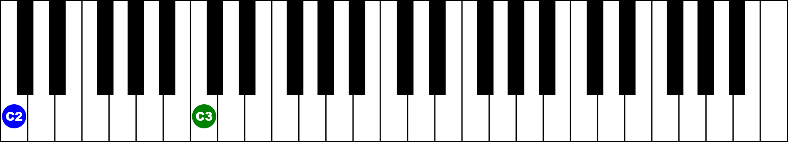
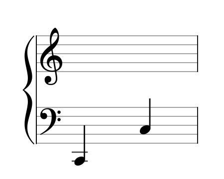

# musictheory-lib
Node.js lib for handling notes, intervals and chords

This is a small node.js library to handle the representation and generation of musical notes, intervals and chords.
I wrote it mostly to generate flashcards for [ANKI](https://apps.ankiweb.net/) to train myself in the recogonition of musical intervals and chords. (to see some examples how this is done look into the `./generators` folder)

Use it for whatever suits you!

## Installation

install packages: `npm install`  
build lib: `npm run build`  
run tests: `npm run test`  

## Usage

- to generate a note use: ```new Note(`${pitchclass}${octave}${accidental}`)```, for example ```let note = new Note('C5b')```.  
```note.toNiceString()``` renders a string using utf-8 symbols for sharps and flats.  
```note.getEnharmonics()``` returns an array of enharmonics for the given note, for example for `B3` you get `[B3, A3##, C4b, D4bbb]`. 

- to generate an interval use: ```new Interval(note|string, ident, direction)```, for example ```let interval = new Interval(new Note('A4#', 'P5', 'up'))``` to get an array with two notes, first the base `('A4#')` and second the requested interval `('E5#')`.  
`ident` can be any of ```'P1', 'd2',
  'm2', 'A1', 'M2', 'd3', 'm3', 'A2', 'M3', 'd4', 'P4', 'A3', 'A4', 'd5', 'P5', 'd6', 'm6', 'A5','M6', 'd7', 'm7', 'A6', 'M7', 'd8', 'P8', 'A7'```.  
`direction` can be  `'up'` or `'down'`.

- to generate a chord use: ```new Chord(note|string|chordsymbol, quality)```, for example ```let chord = new Chord('C4', 'minor')``` to get an array with three notes, the base `('C4')`, the third `('E4b')` and the fifth `('G4')`.  
The constructor also tries to parse common chordsymbol notations like `'CMaj'`or `'CM#5'`.

- to render an inteval/chord either in a Piano Grand Staff or on a virtual keyboard, your first have to instantiate a `new KeyRenderer()` or a `new ScoreRenderer()` and call `render()` with the object to render and a filepath for the rendered image, for example `new KeyRenderer().render(new Note('C2').getInterval('P8'), '../renderings/perfectFifth.png'))` to get something like this:  


  


 - or `new ScoreRenderer().render(new Note('C2').getInterval('P8'), '../renderings/perfectFifth.png'))` to get something like this:


 


This project is licensed under the terms of the MIT license.

Copyright (c) 2023 zimmeracht

Permission is hereby granted, free of charge, to any person obtaining a copy
of this software and associated documentation files (the "Software"), to deal
in the Software without restriction, including without limitation the rights
to use, copy, modify, merge, publish, distribute, sublicense, and/or sell
copies of the Software, and to permit persons to whom the Software is
furnished to do so, subject to the following conditions:

The above copyright notice and this permission notice shall be included in all
copies or substantial portions of the Software.

THE SOFTWARE IS PROVIDED "AS IS", WITHOUT WARRANTY OF ANY KIND, EXPRESS OR
IMPLIED, INCLUDING BUT NOT LIMITED TO THE WARRANTIES OF MERCHANTABILITY,
FITNESS FOR A PARTICULAR PURPOSE AND NONINFRINGEMENT. IN NO EVENT SHALL THE
AUTHORS OR COPYRIGHT HOLDERS BE LIABLE FOR ANY CLAIM, DAMAGES OR OTHER
LIABILITY, WHETHER IN AN ACTION OF CONTRACT, TORT OR OTHERWISE, ARISING FROM,
OUT OF OR IN CONNECTION WITH THE SOFTWARE OR THE USE OR OTHER DEALINGS IN THE
SOFTWARE.

